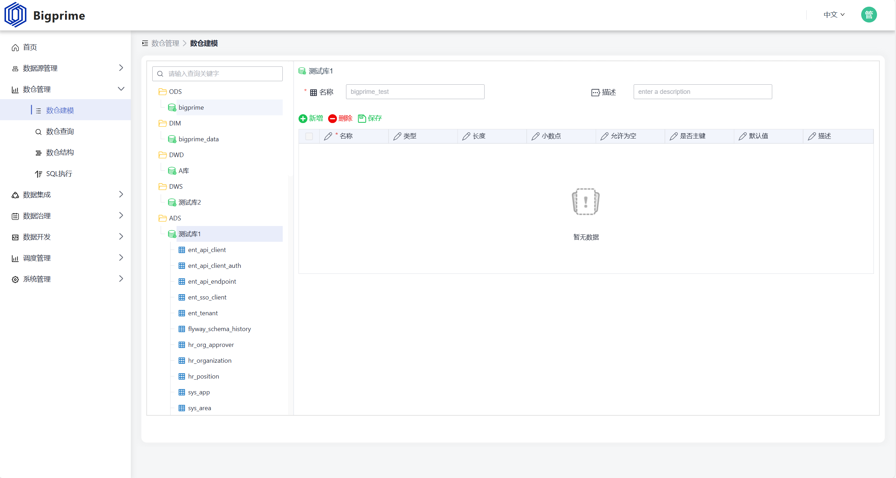
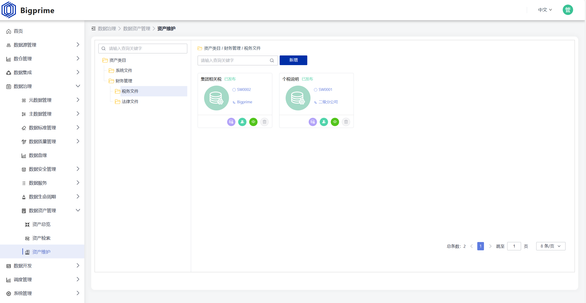

# bigprime-dgp

### 介绍
- Bigprime DGP是一款强大的数据治理平台，它集成了数据仓库、数据湖、数据挖掘、标签、指标、AI算法、物联、身份认证、消息推送、工作流等先进技术，旨在通过API将这些技术支撑平台的能力输出给前端业务，包括BI业务，为这些业务提供更快速的开发、开拓创新及高质量发展的动力引擎。

### 核心模块
#### 数据源管理
- 数据源管理模块是Bigprime DGP的基石，它支持关系型数据库和非关系型数据库，为数据治理提供丰富的数据源选择。该模块还具备即席查询功能，能够迅速响应用户的数据查询需求。此外，通过插件开发，Bigprime DGP能够支持快速扩展数据源，满足不同场景下的数据接入需求。

#### 数据仓库
- 数据仓库模块提供了数仓分层、建模、即席查询和SQL执行等功能，为用户提供了高效、灵活的数据存储和处理环境。通过数仓分层，用户可以清晰地划分数据层级，提高数据管理的效率和安全性。同时，即席查询和SQL执行功能使得用户能够随时访问和处理数据，满足实时分析的需求。

#### 数据集成
- 数据集成模块支持Seatunnel和Addax等开源数据集成工具，并允许用户自定义集成配置。这意味着用户可以根据自己的需求，快速、灵活地配置数据集成任务，实现不同数据源之间的数据同步和传输。此外，Bigprime DGP还支持用户自定义插件集成配置，进一步扩展了数据集成的功能。

#### 数据治理
- 数据治理模块是Bigprime DGP的核心功能之一，它包括以下子模块。

##### 元数据管理
- 提供元数据同步、检索和维护等功能，帮助用户全面管理数据元信息，提高数据质量和可用性。

##### 主数据管理
- 支持主数据建模、同步、下发、血缘追溯和数据维护等功能，确保主数据的准确性和一致性。

##### 数据标准管理
- 提供标准的创建、发布和变更日志等功能，帮助用户建立和维护数据标准体系。

##### 数据质量管理
- 包括质量配置、报告和定时检测任务等功能，帮助用户监控和提高数据质量。

##### 数据血缘
- 提供数据血缘追踪功能，帮助用户了解数据的来源和流向，提高数据透明度和可追溯性。

##### 数据安全管理
- 支持敏感级别设置、数据脱敏、加密和数据安全规范等功能，确保数据的安全性和合规性。

##### 数据服务
- 提供API配置功能，允许用户对资产进行安全脱敏和加密设置，并记录调用记录，提高数据服务的灵活性和安全性。

##### 数据生命周期管理
- 包括总览、近线归档、离线归档和销毁归档等功能，帮助用户有效管理数据的生命周期，降低存储成本。

##### 数据资产管理
- 提供资产总览、检索、维护、数据库资产即席查询、附件资产下载等功能，并支持安全权限控制和加密，确保数据资产的安全和可控。

#### 数据开发
- 数据开发模块提供了任务总览、Flink配置、Flink SQL可视化开发和Flink执行实例等功能，支持多版本Flink的接入和使用。这使得用户能够轻松地进行数据开发和处理任务，提高数据处理的效率和准确性。

#### 调度管理
- 调度管理模块包括调度器管理、默认Quartz调度、调度任务配置和调度任务实例等功能。它支持多种任务类型，如数据库执行、SQL执行、JAR上传、Python文件和API接口调用等，并允许用户自定义开发调度任务。这使得用户能够灵活地进行任务调度和管理，提高数据处理的自动化和智能化水平。

#### 系统管理
- 系统管理模块是Bigprime DGP的基础配置和管理中心，主要包括组织、角色、人员、菜单和基础配置（如文件存储）等功能。通过系统管理模块，用户可以轻松地进行用户管理和权限分配，确保平台的安全性和稳定性。同时，基础配置功能使得用户能够灵活配置平台的存储和文件管理等参数，满足不同的业务需求。

### 核心优势
- **高度集成与可扩展性**
  - **多源数据集成：** Bigprime DGP支持多种数据源，包括关系型数据库、非关系型数据库等，并可通过插件扩展快速接入新的数据源，实现数据的全面整合。
  - **灵活扩展：** 平台提供丰富的API接口和插件机制，允许用户根据业务需求进行自定义开发，扩展平台功能，满足个性化需求。

- **强大的数据治理能力**
  - **全面数据治理：** 涵盖元数据管理、主数据管理、数据标准管理、数据质量管理、数据血缘、数据安全管理、数据服务和数据生命周期管理等关键领域，形成闭环的数据治理体系。

- **高效的数据开发与调度**
  - **可视化开发：** 提供Flink SQL可视化开发环境，降低数据开发门槛，提高开发效率。
  - **智能调度：** 支持多种任务类型和自定义调度策略，实现任务的自动化执行和监控，确保数据处理的及时性和准确性。

- **安全可靠的数据保障**
  - **多层次安全防护：** 通过身份认证、数据加密、数据脱敏等安全措施，保护数据安全，防止数据泄露和滥用。
  - **合规性管理：** 支持数据安全规范和合规性检查，确保数据处理符合相关法律法规要求。

- **卓越的用户体验与易用性**
  - **直观界面：** 提供简洁明了的用户界面，降低学习成本，提高用户操作效率。

- **全面的支持与服务**
  - **专业团队：** 拥有专业的技术支持团队，提供及时、专业的技术支持和解决方案。
  - **社区与资源：** 建立活跃的社区，提供丰富的文档、教程资源，帮助用户更好地使用平台。

- **持续优化与升级**
  - **持续迭代：** Bigprime DGP团队不断关注行业动态和用户需求，持续优化平台功能，提高平台性能和稳定性。
  - **兼容性与适配：** 确保平台与主流操作系统、数据库和中间件等兼容，方便用户在不同环境下部署和使用。

### 快速开始
- [官方文档](http://124.71.15.237:6380/)

### 测试环境地址
- [测试地址](http://124.71.15.237:8259/#/login/)

### 联系我们
- **欢迎您加入社区交流分享**
  - **微信交流群**
  

  - **QQ交流群：加群备注：Bigprime Data Integration**
  
  

